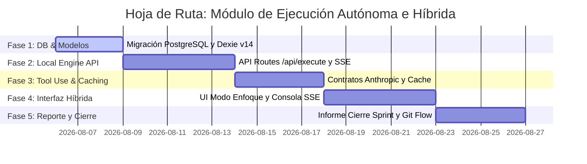

# Plan de Automatización de Ejecución (Flujo Híbrido, Autónomo y Agnóstico)

> ⚠️ **Superseded parcialmente por [`ROADMAP_AUTOMATIZACION_IA.md`](./ROADMAP_AUTOMATIZACION_IA.md).**
> El modelo de datos de las secciones 1-2 (checkpoints, config de automatización) sigue
> vigente y se extiende ahí. La sección 3 (motor de ejecución vía API cruda de Anthropic
>
> - Tool Use manual en un route de Next.js) queda reemplazada por un runner local con
>   Claude Code headless — ver el roadmap nuevo para el diseño vigente y las fases activas.

Este documento define la planificación técnica detallada para implementar el Módulo de Ejecución Autónoma e Híbrida de Sprints y Actividades en MateCode 2.0. El diseño garantiza flexibilidad, resiliencia con checkpoints de estado, validación agnóstica del stack de software y optimización del costo de tokens con caching.

---

## 1. Auditoría del Sistema Actual y Puntos de Cambio

Para integrar la automatización y el flujo híbrido sin romper la compatibilidad con el modo manual, se deben realizar las siguientes refactorizaciones en el frontend y la base de datos local:

### UI & Componentes React

1. **[conveyor-belt-focus-view.tsx](file:///c:/Users/mari_/OneDrive/Escritorio/t/PROYECTS/ACTIVOS/PERSONALES/MateCode2.0/src/presentation/components/proyectos/desarrollo/conveyor-belt-focus-view.tsx):**
   - **Entrada de Control Híbrido:** Reemplazar el área de Handoff manual con una sección dinámica que dependa del estado de ejecución de la actividad.
   - **Botonera de Acción Híbrida:** Añadir botones condicionales para:
     - `⚡ Iniciar Ejecución Autónoma` (Lanza la petición API local).
     - `📋 Copiar Prompt de Actividad` (Conserva el flujo manual).
     - `⚠️ Reintentar con IA` (Disponible si se detiene en un checkpoint de error).
     - `Revertir Cambios Git` (Hace rollback de la rama local).
   - **Consola de Consola SSE en Tiempo Real:** Añadir un visor de terminal colapsable que muestre la salida del linter, compilador y test runner durante la fase autónoma.
2. **[sprint-enfoque-tab.tsx](file:///c:/Users/mari_/OneDrive/Escritorio/t/PROYECTS/ACTIVOS/PERSONALES/MateCode2.0/src/presentation/components/proyectos/desarrollo/sprint-enfoque-tab.tsx):**
   - **Botón de Sprint Autónomo:** Añadir el botón `⚡ Ejecutar Sprint` al lado del botón de finalizar sprint. Al presionarlo, iniciará la orquestación en cadena de todas las actividades en columna "Por Hacer" en base a sus IDs numéricos.

---

## 2. Modelo de Base de Datos y Entidades

Para almacenar de manera persistente las configuraciones agnósticas y el estado de la máquina transaccional de checkpoints, extendemos los esquemas de bases de datos.

### 2.1. Esquema DDL SQL (PostgreSQL/Supabase)

```sql
-- Configuración agnóstica de comandos de validación por proyecto
CREATE TABLE public.proyecto_config_automatizacion (
    proyecto_id VARCHAR(255) PRIMARY KEY,
    build_cmd VARCHAR(500) DEFAULT 'npm run build',
    lint_cmd VARCHAR(500) DEFAULT 'npm run lint',
    test_cmd VARCHAR(500) DEFAULT 'npm run test',
    max_retries_linter INT DEFAULT 3,
    creado_en TIMESTAMP DEFAULT CURRENT_TIMESTAMP,
    actualizado_en TIMESTAMP DEFAULT CURRENT_TIMESTAMP
);

-- Historial y checkpoints de ejecuciones de tareas
CREATE TABLE public.task_execution_checkpoints (
    id VARCHAR(255) PRIMARY KEY,
    task_execution_id VARCHAR(255) NOT NULL,
    actividad_id VARCHAR(255) NOT NULL,
    proyecto_id VARCHAR(255) NOT NULL,
    estado_checkpoint VARCHAR(50) NOT NULL, -- 'IDLE', 'IN_PROGRESS_AI', 'QA_VALIDATING', 'QA_RETRYING', 'PAUSED_CHECKPOINT', 'COMPLETED_HANDOFF'
    ultimo_error_logs TEXT,
    ultimo_prompt_refinamiento TEXT,
    reintentos_fallidos INT DEFAULT 0,
    commit_sha_base VARCHAR(100),
    commit_sha_error VARCHAR(100),
    actualizado_en TIMESTAMP DEFAULT CURRENT_TIMESTAMP
);

-- Habilitar RLS
ALTER TABLE public.proyecto_config_automatizacion ENABLE ROW LEVEL SECURITY;
ALTER TABLE public.task_execution_checkpoints ENABLE ROW LEVEL SECURITY;
```

### 2.2. Extensión del Esquema Dexie Local (IndexedDB)

Modificamos [db.ts](file:///c:/Users/mari_/OneDrive/Escritorio/t/PROYECTS/ACTIVOS/PERSONALES/MateCode2.0/src/offline/dexie/db.ts) añadiendo o ampliando los stores correspondientes en una nueva versión (Versión 14):

```typescript
// En db.ts
this.version(14).stores({
  // ... stores existentes
  proyecto_config_automatizacion: "proyectoId",
  task_execution_checkpoints:
    "id, taskExecutionId, actividadId, proyectoId, estadoCheckpoint",
});
```

---

## 3. Arquitectura del Engine de Ejecución Local (API Route)

El backend de desarrollo local (`Next.js API Route`) es el encargado de interactuar con el sistema de archivos del host, ejecutar comandos de terminal y llamar a la API de Anthropic mediante Tool Use.

### 3.1. Declaración del Contrato Tool Use

Definimos la herramienta de registro de handoff para obligar a Claude a estructurar los cambios técnicos antes de pasar a la etapa de validación:

```typescript
const toolRegistrarHandoff = {
  name: "registrar_handoff_tecnico",
  description:
    "Registra los cambios técnicos, contratos exportados y actualizaciones documentales del ticket completado.",
  input_schema: {
    type: "object",
    properties: {
      archivos_creados_o_modificados: {
        type: "array",
        items: { type: "string" },
        description: "Lista de rutas relativas de archivos creados o editados.",
      },
      firmas_o_contratos_exportados: {
        type: "array",
        items: { type: "string" },
        description:
          "Lista de firmas de funciones, endpoints API, tipos TypeScript o esquemas SQL modificados.",
      },
      resumen_tecnico: {
        type: "string",
        description:
          "Breve resumen arquitectónico de los cambios y decisiones tomadas.",
      },
      update_docs: {
        type: "object",
        properties: {
          schema: {
            type: "string",
            description: "Contenido completo modificado de SCHEMA.md",
          },
          sitemap: {
            type: "string",
            description: "Contenido completo modificado de SITEMAP.md",
          },
          roles: {
            type: "string",
            description: "Contenido completo modificado de ROLES.md",
          },
          errors: {
            type: "string",
            description: "Contenido completo modificado de ERRORS.md",
          },
          seed: {
            type: "string",
            description: "Contenido completo modificado de SEED.md",
          },
          design: {
            type: "string",
            description: "Contenido completo modificado de DESIGN.md",
          },
        },
      },
    },
    required: ["archivos_creados_o_modificados", "resumen_tecnico"],
  },
};
```

### 3.2. Endpoint Next.js `/api/execute/route.ts` con SSE

La API expone un Server-Sent Events stream para comunicar los comandos en ejecución y el estado de la IA sin congelar la pestaña del navegador:

```typescript
import { NextRequest } from "next/server";
import { exec } from "child_process";
import { promisify } from "util";
import { Anthropic } from "@anthropic-ai/sdk";
import fs from "fs/promises";
import path from "path";

const execAsync = promisify(exec);
const anthropic = new Anthropic({ apiKey: process.env.ANTHROPIC_API_KEY });

export async function POST(req: NextRequest) {
  const { proyectoId, actividadId, prompt, config } = await req.json();
  const encoder = new TextEncoder();

  const stream = new ReadableStream({
    async start(controller) {
      const sendEvent = (event: string, data: any) => {
        controller.enqueue(
          encoder.encode(`event: ${event}\ndata: ${JSON.stringify(data)}\n\n`)
        );
      };

      try {
        // 1. Notificar inicio de llamada a la IA
        sendEvent("status", {
          state: "IN_PROGRESS_AI",
          message: "Enviando especificaciones a la IA...",
        });

        // Recuperar especificaciones estáticas locales para aplicar Prompt Caching
        const schemaContent = await fs
          .readFile(path.join(process.cwd(), "SCHEMA.md"), "utf-8")
          .catch(() => "");
        const errorsContent = await fs
          .readFile(path.join(process.cwd(), "ERRORS.md"), "utf-8")
          .catch(() => "");

        // Llamada a Anthropic con Tool Use y Caching
        const response = await anthropic.beta.promptCaching.messages.create({
          model: "claude-3-5-sonnet-20241022",
          max_tokens: 4000,
          system: [
            {
              type: "text",
              text: "Eres un desarrollador e ingeniero de software senior. Modifica el código local basándote en el contexto y los estándares del proyecto.",
              cache_control: { type: "ephemeral" }, // Caché del prompt del sistema
            },
          ],
          messages: [
            {
              role: "user",
              content: [
                {
                  type: "text",
                  text: `CONTEXTO DEL PROYECTO:\nSCHEMA:\n${schemaContent}\n\nERRORS:\n${errorsContent}`,
                  cache_control: { type: "ephemeral" }, // Caché del contexto pesado
                },
                {
                  type: "text",
                  text: prompt,
                },
              ],
            },
          ],
          tools: [
            toolRegistrarHandoff,
            {
              name: "modificar_archivo",
              description: "Escribe o edita un archivo en el proyecto local.",
              input_schema: {
                type: "object",
                properties: {
                  ruta: { type: "string" },
                  contenido: { type: "string" },
                },
                required: ["ruta", "contenido"],
              },
            },
          ],
        });

        // 2. Procesar las llamadas a herramientas que hizo la IA (Ej: Modificar archivos)
        sendEvent("status", {
          state: "QA_VALIDATING",
          message: "IA completó cambios. Iniciando bucle de pruebas locales...",
        });

        for (const toolCall of response.content) {
          if (
            toolCall.type === "tool_use" &&
            toolCall.name === "modificar_archivo"
          ) {
            const { ruta, contenido } = toolCall.input as any;
            const fullPath = path.join(process.cwd(), ruta);
            await fs.mkdir(path.dirname(fullPath), { recursive: true });
            await fs.writeFile(fullPath, contenido, "utf-8");
            sendEvent("console", {
              type: "write",
              message: `Archivo modificado: ${ruta}`,
            });
          }
        }

        // 3. Bucle de Validación Agnóstico (Build, Lint, Test)
        let lintPassed = false;
        try {
          sendEvent("console", {
            type: "exec",
            message: `Ejecutando linter: ${config.lint_cmd}`,
          });
          const { stdout, stderr } = await execAsync(config.lint_cmd);
          sendEvent("console", { type: "success", message: stdout });
          lintPassed = true;
        } catch (err: any) {
          sendEvent("console", {
            type: "error",
            message: `Fallo en Linter:\n${err.stdout || err.message}`,
          });
          // Lógica de reintento automático se dispara informando el fallo de validación
          sendEvent("status", {
            state: "QA_RETRYING",
            message:
              "Fallo detectado. Reportando logs a la IA para autocorrección...",
          });
          // (Aquí se llamaría a la recursión de reintento con el error adjunto)
        }

        if (lintPassed) {
          sendEvent("status", {
            state: "COMPLETED_HANDOFF",
            message: "Validaciones exitosas. Handoff listo para registrar.",
          });
        }
      } catch (error: any) {
        sendEvent("status", {
          state: "PAUSED_CHECKPOINT",
          message: `Error crítico en ejecución: ${error.message}`,
        });
      } finally {
        controller.close();
      }
    },
  });

  return new Response(stream, {
    headers: {
      "Content-Type": "text/event-stream",
      "Cache-Control": "no-cache",
      Connection: "keep-alive",
    },
  });
}
```

---

## 4. Plan de Resiliencia, Fallback y Control Git

Para garantizar que el flujo autónomo no destruya el entorno de desarrollo local y permita la recuperación híbrida, se definen los siguientes mecanismos:

### 4.1. Checkpoint y Rollback Git

- **Antes de iniciar la IA:** MateCode realiza un commit automático de checkpoint en Git (`git commit -am "matecode-checkpoint-[actividadId]"`) o crea un stash temporal.
- **Si la IA falla o se pausa:** Los archivos modificados quedan en la rama local de feature de la actividad. El frontend cambia el estado visual del ticket a `PAUSED_CHECKPOINT`.
- **Acciones del Desarrollador en Fallback:**
  - **Retomar Manualmente:** El desarrollador puede abrir su VS Code, leer los logs de la consola embebida que falló, arreglar el bug en el archivo de código y guardar los cambios. En MateCode, puede pulsar `Completar Manualmente` pegando el handoff, o presionar `Dejar que IA revalide` para volver a disparar el linter/test y continuar en autónomo.
  - **Revertir Cambios (Rollback):** El botón `Revertir Cambios Git` ejecuta en el backend `git reset --hard HEAD` o `git checkout .`, limpiando el árbol de trabajo local para volver al estado inicial del ticket.

---

## 5. Hoja de Ruta de Implementación (Step-by-Step)

La integración de la automatización se estructurará en 5 fases secuenciales:



1. **Fase 1: Base de Datos y Modelos (Días 1-3):**
   Creación de las tablas PostgreSQL en Supabase, definición de los modelos locales en Dexie y migración a la versión 14 de base de datos.
2. **Fase 2: API Routes y Subprocesos (Días 4-8):**
   Construcción de `/api/execute/route.ts` en Next.js. Implementación de los streams de eventos Server-Sent Events (SSE) y la lógica para spawnear comandos linter y compilador a nivel de sistema operativo.
3. **Fase 3: Tool Use y Prompt Caching (Días 9-12):**
   Definición y registro de las herramientas (`modificar_archivo` y `registrar_handoff_tecnico`) para la API de Anthropic y configuración de los headers de caching para los documentos de especificaciones locales.
4. **Fase 4: Interfaz Híbrida en Modo Enfoque (Días 13-17):**
   Rediseño de la pantalla de Modo Enfoque agregando la consola del terminal en vivo con stream SSE, los botones de acción rápida manual/autónomo, y controles de guardado de checkpoints.
5. **Fase 5: Reporte de Sprint y Git Automation (Días 18-21):**
   Implementación del pipeline de merge/checkout automático en Git y desarrollo del generador de `INFORME_SPRINT.md` combinando los handoffs completados del sprint.
